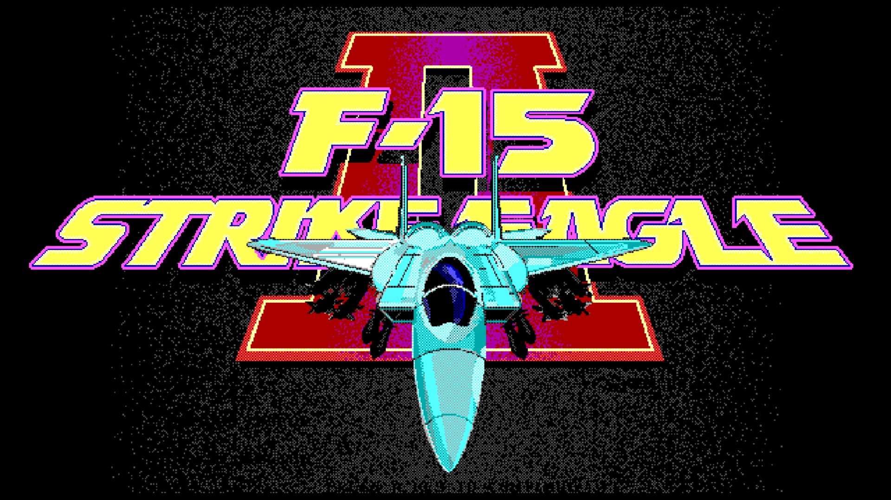
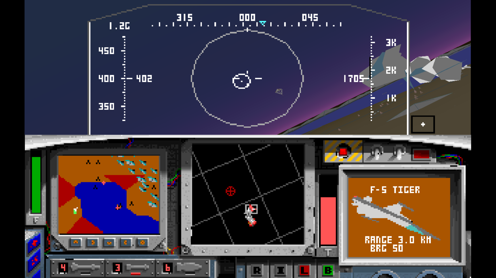
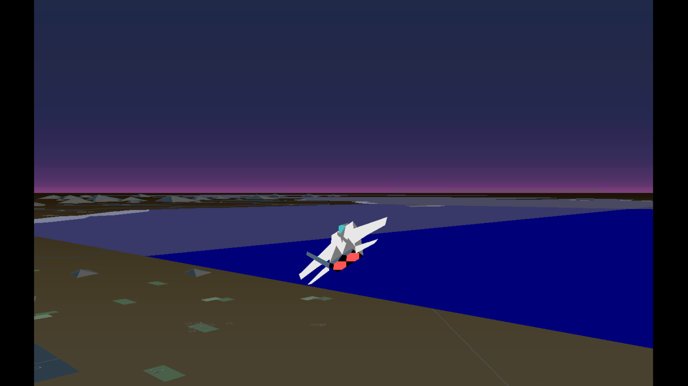
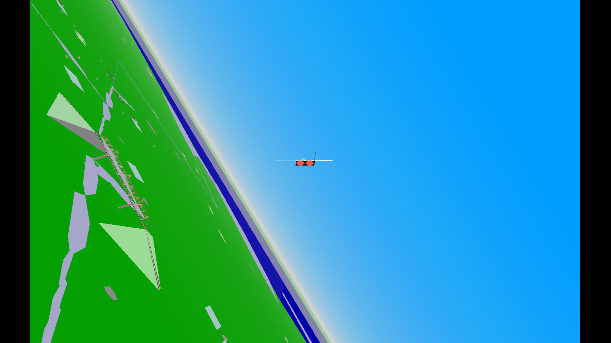
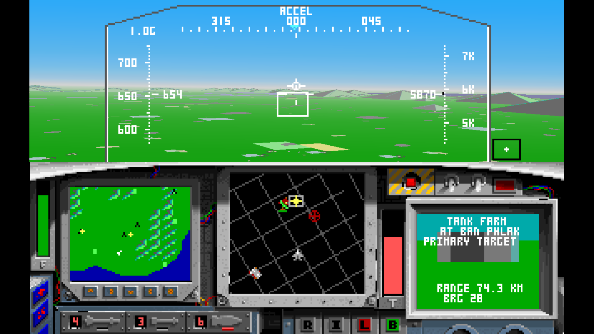
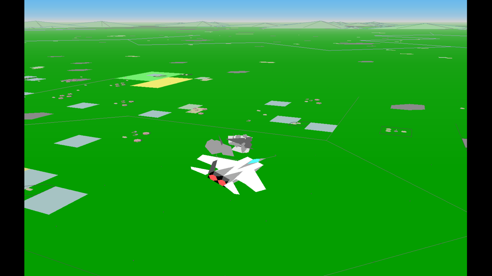
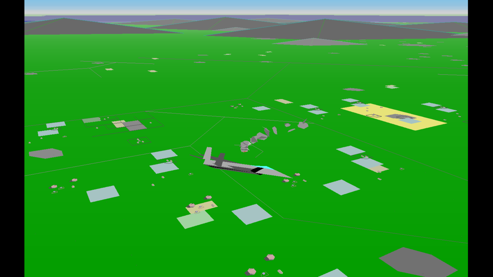

# F-15 Strike Eagle 2 source port

<p align="center">
  
</p>

This is a work in progress project to port, fix and enhance the [reconstructed source code](https://github.com/neuviemeporte/f15se2-re) of the Microprose game F-15 Strike Eagle 2 v451.03 (the definitive 1991 Desert Storm expansion disk version) for modern architectures.

Unlike the old project, whose aim was a bug-for-bug, instruction-level faithful recreation of the game for the orginal MS-DOS platform and the MS C v5.1 compiler, here we aim to keep as much of the game's spirit intact, while taking it forward into the 21st century with modern compilers and libraries, better graphics and enhanced features.

The repository was forked off from tag `v0.9.2`, and the idea is that the reconstruction will see occasional backports from this project which provide bugfixes, clarify or document the original code, but of course these will need to make sure to preserve the contract of instruction-level identity with the original.

The project is based on the [SDL3 library](https://github.com/libsdl-org/SDL/releases) for the graphical frontend.

Development journal: https://neuviemeporte.github.io/category/f15-se2

## Status (27.06.2026)

The entire game is playable, rendering and input handling is ported to SDL, sound works using Adlib emulation through [Nuked-OPL3](https://github.com/nukeykt/Nuked-OPL3), joystick input is supported (not configurable right now).

## Screenshots

<div align="center">
  <table>
    <tr>
      <td align="center">
        <a href="screenshots/screen1.png"></a>
      </td>
      <td align="center">
        <a href="screenshots/screen2.png"></a>
      </td>
      <td align="center">
        <a href="screenshots/screen3.png"></a>
      </td>
    </tr>
    <tr>
      <td align="center">
        <a href="screenshots/screen4.png"></a>
      </td>
      <td align="center">
        <a href="screenshots/screen5.png"></a>
      </td>
      <td align="center">
        <a href="screenshots/screen6.png"></a>
      </td>
    </tr>
  </table>
</div>

## Current enahncements over the original game

1. The original was limited to 15 FPS with a convoluted time scale implementation to make sure the game engine kept up with rendering. This has been eliminated, with the game engine being decoupled from rendering, so now it plays much smoother. 
2. Input loop has been upgraded to an SDL event pump which should make it deal with simultaneous inputs much bettern and improve general responsiveness.
3. The game originally supported 4 levels of detail (`0-3`, switchable with `Alt-D`), with the highest one still suffering from limited draw distance. An additional level of detail (`4`) has been implemented with unlimited draw distance, and enabled by default.
4. Rendering has been moved out of the bespoke software engine that was capped at `320x200` resolution (still available with `F15_RENDER=software` envvar) and into OpenGL, enabling higher resolutions and improved clarity. At a later time, perhaps it will also be possible to upgrade the original software renderer to support higher resolutions.
5. Air targets are now also selectable with the `T` key, just like ground targets.

## Planned features and improvements

These are things that were never part of, or were broken in the original that are planned to get fixed in this project.

1. Implement a full 3D cockpit with 3DOF/6DOF head movement with the hat switch and/or TrackIR.
2. Fix 3D object occlusion, difficult now due to the engine handling the draw order and aspects of rendering in an unorthodox way, many models containing coplanar surfaces which will z-fight if occlusion is just enabled as is.
3. Make the square bounding boxes marking objects like planes and missiles move less erratically when the object is close to the player.
4. Make the missiles more difficult to evade, as it's currently trivial (just beam them, i.e. put them on approx 90deg angle to the plane). Implement quasi-realistic self propelled/ballistic stages, have missile run out of energy and maneuverability when propellant has been burned off.
5. Make the gun more predictable, right now it's spraying all over the place so it's difficult to tell where it's going. Show nice tracers, make them affected by gravity etc.
6. Implement missile trails for better situational awareness/cool visuals.
7. In-game menu for configuration (keyboard/joystick binds, video resolution, turn engine sounds on and off, ...)
8. More realistic plane handling, right now it's too responsive, turns too quickly.
9. Better damage model for player aircraft, currently being hit by a missile only results in a small drop of maximum RPM. Simulate full/partial loss of stability, broken systems, weapons, hydraulics etc., up to instant destruction.
10. Better clouds and smoke effects, right now these are solid polygons in mid air.
11. More varied terrain and water, these are completely flat with an occasional pyramids that are supposed to represent mountains. It can continue to be flat shaded/polygon based to not change the look of the game too much, but we definitely need more vertices.
12. Let player skip the ejection sequence and go straight to debriefing.

12. Scenario/model editor.
13. Widescreen support.
14. Multiplayer.
15. Port the game back to 32bit DOS.
16. VR support. 😈

## Known bugs

Problems with the game that were introduces by the port, and to the best of our knowledge are not present in the original.

1. Sometimes after starting a mission, planes and missiles are invisible.
2. Fired missiles (Maverick only?) sometimes disappear near the target without a message ("Ineffective hit") or any other feedback.
3. It's sometimes impossible to lock some targets even when nearby, cycling targets just jumps over them.
4. The "BRG" bearing value in the target screen is sometimes a huge positive value (overflow?).
5. In the debriefing screen, plane names are only the long string e.g. "Flogger shot down".
6. When starting a new mission after a previous one has been completed, the sound for the previous flight's landing ("Nice landing") is played, looks as if the sound queue is not drained before terminating the previous mission?

## Building

The build system is [CMake](https://cmake.org/download/) with [Ninja](https://github.com/ninja-build/ninja/releases) being used as the generator backend. It is intended to be built with Clang, but gcc also seems to work. To build, run:

```
$ cmake --preset <preset-name> # only needed the first time around, or when making changes to cmake files
$ cmake --build build
```

The project includes the default preset `base-ninja` in `CMakePresets.json`. It's possible to manually override platform-specific values for the build using CMake's user presets.

### Linux

On Ubuntu, I got to build with the default preset. The only thing needed was to install SDL3 with apt:

```
$ sudo apt install libsdl3-dev
$ cmake --preset base-ninja
$ cmake --build build
```

### Windows

To build on Windows using [llvm-mingw](https://github.com/mstorsjo/llvm-mingw), I use this `CMakeUserPresets.json`:

```
{
  "version": 3,
  "configurePresets": [
    {
      "name": "windows-clang",
      "inherits": "base-ninja",
      "displayName": "Local Windows Clang + SDL3",
      "environment": {
        "CC": "D:/utility/llvm-mingw-20260616-ucrt-x86_64/bin/clang.exe",
        "CXX": "D:/utility/llvm-mingw-20260616-ucrt-x86_64/bin/clang++.exe"
      },
      "cacheVariables": {
        "CMAKE_BUILD_TYPE": "Debug",
        "CMAKE_PREFIX_PATH": "D:/code/SDL3-3.4.10/x86_64-w64-mingw32"
      }
    }
  ]
}
```

With this, I run `cmake --preset windows-clang` followed by `cmake --build build` to obtain `build/f15se2.exe`. It also needs `SDL3.dll` from `SDL3-3.4.10\x86_64-w64-mingw32\bin` in the same directory to run.
