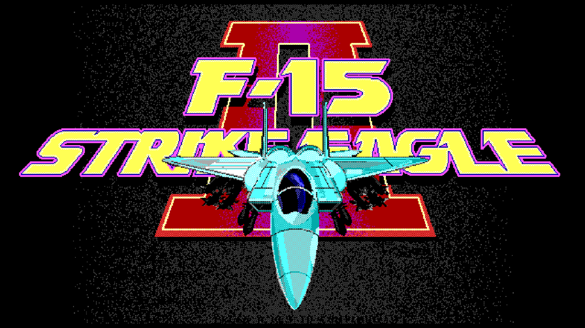
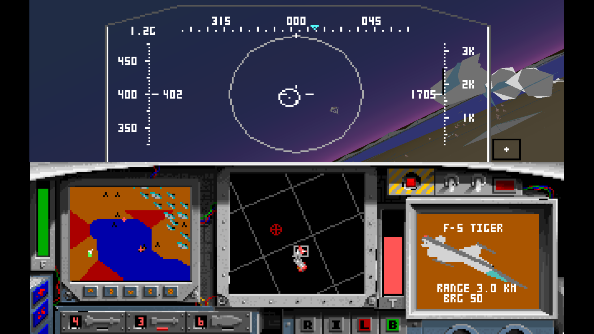
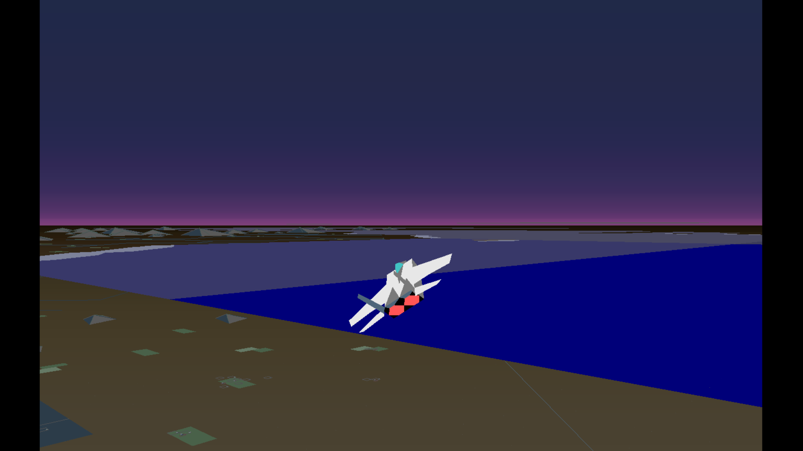
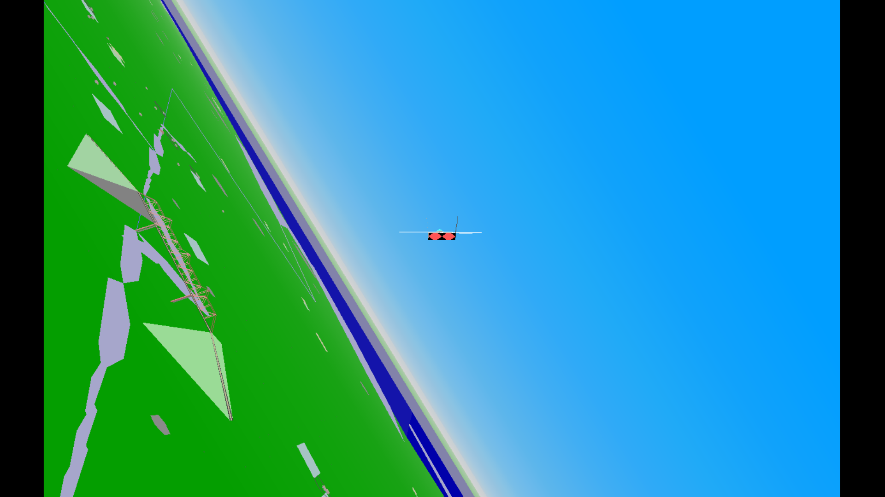
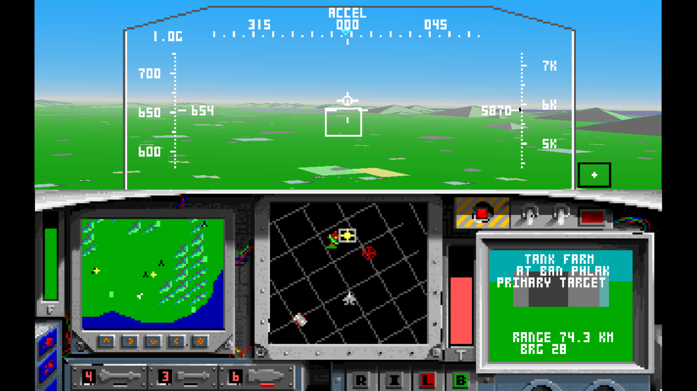
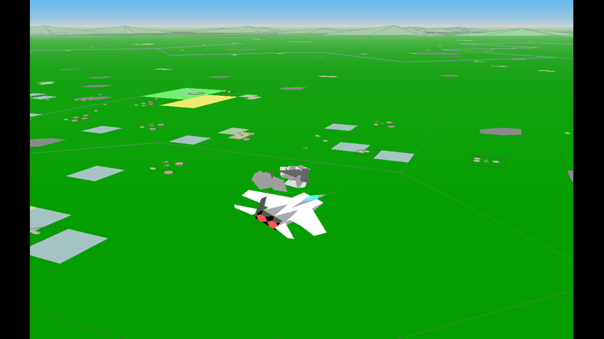
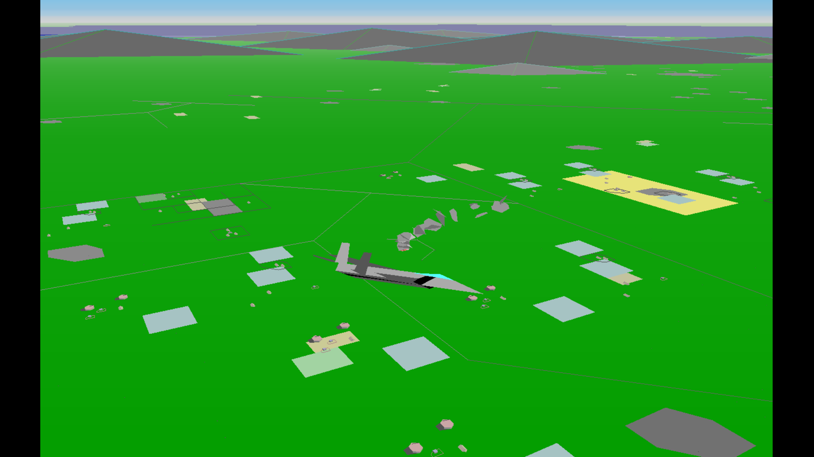

# F-15 Strike Eagle 2 source port

[](https://github.com/neuviemeporte/f15se2-ex/actions/workflows/ci.yml)
[](https://codecov.io/github/neuviemeporte/f15se2-ex)

<p align="center">
  
</p>

This is a work in progress project to port, fix and enhance the [reconstructed source code](https://github.com/neuviemeporte/f15se2-re) of the Microprose game F-15 Strike Eagle 2 v451.03 (the definitive 1991 Desert Storm expansion disk version) for modern architectures.

Unlike the old project, whose aim was a bug-for-bug, instruction-level faithful recreation of the game for the orginal MS-DOS platform and the MS C v5.1 compiler, here we aim to keep as much of the game's spirit intact, while taking it forward into the 21st century with modern compilers and libraries, better graphics and enhanced features.

The repository was forked off from tag `v0.9.2`, and the idea is that the reconstruction will see occasional backports from this project which provide bugfixes, clarify or document the original code, but of course these will need to make sure to preserve the contract of instruction-level identity with the original.

The project is based on the [SDL3 library](https://github.com/libsdl-org/SDL/releases) for the graphical frontend.

Development journal: https://neuviemeporte.github.io/category/f15-se2

## Status

The entire game is playable, rendering and input handling is ported to SDL, sound works using Adlib emulation through [Nuked-OPL3](https://github.com/nukeykt/Nuked-OPL3) and joystick/gamepad input is supported (though not configurable right now). Multiple improvements have been implemented including high resolution and widescreen support with some bugs from the original having been fixed too. Work is ongoing to add more features and eliminate bugs.

## Raw joystick controls

Linux/SDL supplies calibrated axis values; no in-game calibration is needed.
Mapped gamepads retain their existing layout. Other joysticks get these defaults,
limited to the buttons actually available:

| Button | Action |
| --- | --- |
| 1 | Fire cannon |
| 2 | Fire missile |
| 3 | Countermeasures: alternate chaff, flare, one per press |
| 4 | Cycle Sidewinder, medium-range missile, Maverick |
| 5 | Increase thrust, when no throttle axis is configured |
| 6 | Decrease thrust, when no throttle axis is configured |
| 7 | Toggle landing gear |
| 8 | Toggle autopilot |
| 9 | Next target |
| 10 | Cycle cockpit / external follow / dynamic / side views |

On Linux, an axis reported by the driver as throttle is assigned automatically,
regardless of joystick model. If this metadata is unavailable (including on
other platforms), extra axes are not guessed: set `F15_JOY_THROTTLE_AXIS=3`
to use the third axis, or `0` to
disable it. Axes 1/2 remain roll/pitch. Throttle covers 0-100%; keyboard
afterburner remains available. Set `F15_JOY_THROTTLE_INVERT=0` to reverse the
default lever direction. Keyboard controls remain available on smaller sticks.

Button overrides are `F15_JOY_MISSILE`, `F15_JOY_COUNTERMEASURE`,
`F15_JOY_CANNON`, `F15_JOY_WEAPON`, `F15_JOY_THRUST_UP`, and
`F15_JOY_THRUST_DOWN`, `F15_JOY_GEAR`, `F15_JOY_AUTOPILOT`,
`F15_JOY_TARGET`, and `F15_JOY_VIEW`.
Values are one-based physical button numbers; `0`
disables a binding. Assign distinct buttons to avoid overlapping actions.
For example, `F15_JOY_CANNON=2 F15_JOY_MISSILE=1 ./build/f15se2-ex --game /path/to/game`
exchanges missile and cannon buttons. These settings apply to the active raw
joystick, not mapped gamepads.

When a raw joystick is connected at startup, the game shows a button setup
screen using its original bitmap fonts. Continue is selected initially: press
any joystick button to save and play. Move the stick up/down or left/right
to select an action, then press the desired joystick button to assign it.
Keyboard arrows also select actions. Press the currently assigned button again
(or Delete) to unassign it; assigning an occupied button swaps the actions.
Select Continue and press any joystick button, or press Enter/Escape, to save
and play. If saving fails, the screen reports it; Continue again plays without
saving. Mapped gamepads retain their existing bindings and skip this screen.

Button mappings are saved per SDL device GUID and control counts in SDL's user
settings directory (`f15se2-ex/joystick`), not in the game-assets directory.
Identical devices with the same GUID and counts share a profile. Set
`F15_JOY_CONFIG_DIR` to choose another directory. The text format uses one-based
button numbers (zero disables an action). Loading applies defaults, then saved
bindings, then explicit environment overrides. Invalid files leave defaults
unchanged. Throttle-axis selection remains automatic or environment-configured.

In the other menus, move the stick to select, press physical button 1 to
confirm, or button 2 to go back. These menu controls are independent of the
flight assignments. Pilot-name text entry still uses the keyboard.

## Screenshots

<div align="center">
  <table>
    <tr>
      <td align="center">
        <a href="screenshots/screen1.png"></a>
      </td>
      <td align="center">
        <a href="screenshots/screen2.png"></a>
      </td>
      <td align="center">
        <a href="screenshots/screen3.png"></a>
      </td>
    </tr>
    <tr>
      <td align="center">
        <a href="screenshots/screen4.png"></a>
      </td>
      <td align="center">
        <a href="screenshots/screen5.png"></a>
      </td>
      <td align="center">
        <a href="screenshots/screen6.png"></a>
      </td>
    </tr>
  </table>
</div>

## Completed improvements

These are bugfixes and new features that were not part of the original game, and implemented by this project.

1. The original was limited to 15 FPS with a convoluted time scale implementation to make sure the game engine kept up with rendering. This has been eliminated, with the game engine being decoupled from rendering, so now it plays much smoother. 
1. Input loop has been upgraded to an SDL event pump which should make it deal with simultaneous inputs much bettern and improve general responsiveness.
1. The game originally supported 4 levels of detail (`0-3`, switchable with `Alt-D`), with the highest one still suffering from limited draw distance. An additional level of detail (`4`) has been implemented with unlimited draw distance, and enabled by default.
1. Rendering has been moved out of the bespoke software engine that was capped at `320x200` resolution (still available with `F15_RENDER=software` envvar) and into OpenGL (with MSAA), enabling higher resolutions and improved clarity and nicer graphics (particularly the horizon now has fog). At a later time, perhaps it will also be possible to upgrade the original software renderer to support higher resolutions.
1. Smooth movement and high resolution 3D rendering of MFD screens.
1. Air targets are now also selectable with the `T` key, just like ground targets.
1. Widescreen is supported with correct aspect ratio.
1. 3D object occlusion was fixed, was difficult due to the engine handling the draw order and aspects of rendering in an unorthodox way, many models containing coplanar surfaces which would z-fight; solved by introducing depth bias.
1. Gun spread and target hitboxes are improved, it is actually possible to aim the gun now.
1. Missiles follow the actually selected targets instead of the closest one.
1. Asset converters allow loading original 3D models into modeling software, could lead to better/more models in the future. Fonts and sprites are also exported.

## Planned improvements

1. Make the missiles more difficult to evade, as it's currently trivial (just beam them, i.e. put them on approx 90deg angle to the plane). Implement quasi-realistic missile energy management with self propelled/ballistic stages and gradual reduction in maneuverability. Denser air at lower altitudes should influence missile drag. Terrain masking should make missiles lose track.
1. Countermeasures (chaff/flare) are too effective (100%) against missiles. Take missile aspect into account, e.g. chaff should not do much for a missile coming straight on, and flares should be less effective against a heat seeker missile coming from the rear.
1. Make enemy plane AI more capable, right now planes are barely a nuisance, slow, barely maneuvering, will rarely shoot missiles, not sure getting hit by gunfire is even possible.
1. More realistic player aircraft handling, right now it's too responsive, turns too quickly.
1. Implement missile trails for better situational awareness/cool visuals.
1. Make the target view in the right display show the actual view of the target from the player's perspective, right now it's just drawn on top of fake ground and sky.
1. In-game menu for configuration (keyboard/joystick binds, video resolution, turn engine sounds on and off, ...)
1. Better damage model for player aircraft, currently being hit by a missile only results in a small drop of maximum RPM. Simulate full/partial loss of stability, broken systems, weapons, hydraulics etc., up to instant destruction.
1. Better clouds and smoke effects, right now these are solid polygons in mid air.
1. More varied terrain and water, these are completely flat with occasional pyramids that are supposed to represent mountains. It can continue to be flat shaded/polygon based to not change the look of the game too much, but we definitely need more vertices and/or textures.
1. Add more information (altitude/speed) to the target display MFD for airborne targets.
1. Let player skip the ejection sequence and go straight to debriefing.
1. It's sometimes impossible to lock some targets even when nearby, cycling targets just jumps over them.
1. Implement a full 3D cockpit with 3DOF/6DOF head movement with the hat switch and/or TrackIR.
1. Map and 3D model editors.
1. Multiplayer.
1. Port the game back to 32bit DOS.
1. VR support. 😈

## Known bugs

Problems with the game that were introduces by the port, and to the best of our knowledge are not present in the original.

1. There seem to be some kind of gimbal lock problems with the input; pointing the plane straight up or straight down, then rolling 90 degrees to either side and pulling on the stick seems to have little to no effect.
1. In external views sometimes the view is upside down (seems like it depends on the position relative to the horizon?).
1. The bearing (`BRG`) value on the airborne target screen is broken, mostly stuck on one value even though target is visibly turning.
1. When starting a new mission after a previous one has been completed, the sound for the previous flight's landing ("Nice landing") is played. Sometimes the message "Weapons replenished" also appears. It seems not all state from the previous mission is properly cleaned.
1. There's sometimes flickering beneath and above the left display (map) in the cockpit.
1. Shaking in the cockpit after getting hit is too long.
1. When on the airfield/carrier, can see through to the ground on the sides of the view (exposed by widescreen support). Also, aircraft geometry sometimes flickers beneath the player.
1. Some z-fighting still visible, e.g. on the underside of the player aircraft in external view.

## Building

The build system is [CMake](https://cmake.org/download/) with [Ninja](https://github.com/ninja-build/ninja/releases) being used as the generator backend. It's been built successfully with both gcc and Clang. To build, run:

```
$ cmake --preset <preset-name> # only needed the first time around, or when making changes to cmake files
$ cmake --build build
```

The project includes the default preset `base-ninja` in `CMakePresets.json`. It's possible to manually override platform-specific values for the build using CMake's user presets.

### Linux

On Ubuntu, I got to build with the default preset. The only thing needed was to install SDL3 with apt:

```
$ sudo apt install libsdl3-dev
$ cmake --preset base-ninja
$ cmake --build build
```

### Windows

To build on Windows using [llvm-mingw](https://github.com/mstorsjo/llvm-mingw), I use this `CMakeUserPresets.json`:

```
{
  "version": 3,
  "configurePresets": [
    {
      "name": "windows-clang",
      "inherits": "base-ninja",
      "displayName": "Local Windows Clang + SDL3",
      "environment": {
        "CC": "D:/utility/llvm-mingw-20260616-ucrt-x86_64/bin/clang.exe",
        "CXX": "D:/utility/llvm-mingw-20260616-ucrt-x86_64/bin/clang++.exe"
      },
      "cacheVariables": {
        "CMAKE_BUILD_TYPE": "Debug",
        "CMAKE_PREFIX_PATH": "D:/code/SDL3-3.4.10/x86_64-w64-mingw32"
      }
    }
  ]
}
```

With this, I run `cmake --preset windows-clang` followed by `cmake --build build` to obtain `build/f15se2.exe`. 

Building with MSVC should also work.

## Running

After building, either drop the resulting binary into a directory with the game assets, use the `--game` command line option or the `F15SE2_DIR` environmental variable to set the assets' location. The game checks MD5 checksums on all asset files to make sure they are not corrupted, and will not start unless all files from the original game match up.

## Contributor policy

Contributions to this project are very welcome. However, contributors are expected to follow certain rules to keep the project manageable:

1. We don't discriminate contributors for any reason.
1. Keep politics and sensitive topics out of it, this is not the place for it.
1. No copyrighted content can ever be submitted into the project.
1. Even though this is already a different game than the reconstruction, we try to maintain some degree of compatibility. So, at least for the files which exist in both projects:
    1. Don't move routines around, keep the order as is.
    1. Don't refactor the code unless you are prepared to do it to the reconstruction also. This is actually encouraged, but make sure you plan for the extra work in such case.
    1. If you have a good reason to break compatibility, do so in the possibly least intrusive way. For example, don't drop a huge change in the middle of a legacy routine, factor it out.
1. We don't discourage the usage of LLMs. However, all PRs must be possible to be reviewed by a human and the resulting code needs to be maintainable. Some practical suggestions to that end:
    1. Take on one task at a time.
    1. Keep changes small-ish.
    1. Test every change.
    1. Verify how the change was implemented.
1. Keep the game's spirit and style intact. This is subjective, and we can always discuss specific cases, but the game should remain identifiable as F15 SE2 despite the fresh coat of paint. Whenever a change is implemented that changes the look and feel significantly, try to have it behind a toggle which lets the user flip it on or off at will.
